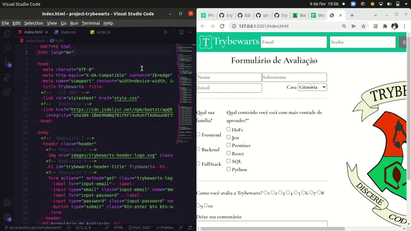

Este projeto contém os requisitos realizados por _[Anna Beatriz Garcia Trajano de Sá](www.linkedin.com/in/anna-beatriz-trajano-de-sá)_ enquanto estudava na [Trybe](https://www.betrybe.com/) :rocket:

# Project Trybewarts

Neste projeto, desenvolvi uma página de formulário da Escola de Magia de Trybewarts, em que as pessoas estudantes poderiam enviar seus feedbacks sobre ela. O tema desse projeto é baseado na obra 'Harry Potter', de J. K. Rowling, já que programar é o mais próximo que podemos chegar de algo verdadeiramente mágico!

Veja o exemplo a seguir do layout do projeto!

## Demo



## Instalação do projeto localmente

Após cada um dos passos, haverá um exemplo do comando a ser digitado para fazer o que está sendo pedido, caso tenha dificuldades e o exemplo não seja suficiente, não hesite em me contatar em _annagarcia@id.uff.br_ 

1. Abra o terminal e crie um diretório no local de sua preferência com o comando mkdir:
```javascript
  mkdir projetos
```
2. Entre no diretório que acabou de criar e depois clone o projeto:

  ```javascript
  cd projetos
  git clone git@github.com:annabia95/project-trybewarts.git
```
Para evitar problemas de CORS, utilize a extensão Live Server do VSCode para conseguir carregar todos os assets externos, com o servidor rodando, abra o arquivo index.html, não é necessário rodar um npm install para ver a aplicação

## Habilidades Desenvolvidas

Neste projeto, desenvolvi as seguintes habilidades:

* Criar formulários em HTML;
* Utilizar CSS Flexbox para criar layouts flexíveis;
* Criar regras CSS específicas para serem aplicadas a dispositivos móveis;
* Construir páginas que alteram o seu layout de acordo com a orientação da tela;

## Escopo do Projeto

   - [x] [1. Crie uma barra verde na parte superior da página](#1-crie-uma-barra-verde-na-parte-superior-da-página)
   - [x] [2. Adicione o logotipo da Trybewarts com a classe `trybewarts-header-logo` na barra superior](#2-adicione-o-logotipo-da-trybewarts-com-a-classe-trybewarts-header-logo-na-barra-superior)
   - [x] [3. Acrescente um formulário de login no canto direito da barra superior contendo os inputs de email, senha e um botão de login](#3-acrescente-um-formulário-de-login-no-canto-direito-da-barra-superior-contendo-os-inputs-de-email-senha-e-um-botão-de-login)
   - [x] [4. Crie um título com o texto `Trybewarts` centralizado dentro do `Header`](#4-crie-um-título-com-o-texto-trybewarts-centralizado-dentro-do-header)
   - [x] [5. Adicione um formulário no corpo da página](#5-adicione-um-formulário-no-corpo-da-página)
   - [x] [6. Faça com que o eixo principal do formulário seja vertical](#6-faça-com-que-o-eixo-principal-do-formulário-seja-vertical)
   - [x] [7. Adicione a logo da Trybewarts no lado direito da página](#7-adicione-a-logo-da-trybewarts-no-lado-direito-da-página)
   - [x] [8. Acrescente ao formulário com id `evaluation-form` os inputs de `nome, sobrenome e email`](#8-acrescente-ao-formulário-com-id-evaluation-form-os-inputs-de-nome-sobrenome-e-email)
   - [x] [9. Acrescente ao formulário um select com o id `house` contendo as opções `Gitnória`, `Reactpuff`, `Corvinode` e `Pytherina`](#9-acrescente-ao-formulário-um-select-com-o-id-house-contendo-as-opções-gitnória-reactpuff-corvinode-e-pytherina)
   - [x] [10. Posicione os campos de `Nome` e `Sobrenome` para que fiquem em linha](#10-posicione-os-campos-de-nome-e-sobrenome-para-que-fiquem-em-linha)
   - [x] [11. Posicione os campos de `Email` e `Casa` para que fiquem em linha](#11-posicione-os-campos-de-email-e-casa-para-que-fiquem-em-linha)
   - [x] [12. Acrescente ao formulário um campo de entrada para qual família a pessoa estudante se identifica](#12-acrescente-ao-formulário-um-campo-de-entrada-para-qual-família-a-pessoa-estudante-se-identifica)
   - [x] [13. Crie campos de entrada do tipo `checkbox` contendo seis opções](#13-crie-campos-de-entrada-do-tipo-checkbox-contendo-seis-opções)
   - [x] [14. Crie campo de entrada para avaliar de 1 a 10 o nível de satisfação com a Trybewarts](#14-crie-campo-de-entrada-para-avaliar-de-1-a-10-o-nível-de-satisfação-com-a-trybewarts)
   - [x] [15. Crie uma textarea com o id `textarea` e uma label com a classe `textarea` contendo o número máximo de caracteres igual à 500](#15-crie-uma-textarea-com-o-id-textarea-e-uma-label-com-a-classe-textarea-contendo-o-número-máximo-de-caracteres-igual-à-500)
   - [x] [16. Crie um campo de entrada do tipo `checkbox` com o id `agreement` para validar as informações](#16-crie-um-campo-de-entrada-do-tipo-checkbox-com-o-id-agreement-para-validar-as-informações)
   - [x] [17. Crie um botão de Enviar para submeter o formulário](#17-crie-um-botão-de-enviar-para-submeter-o-formulário)
   - [x] [18. Faça com que o botão `Enviar` seja habilitado somente após a checkbox do requisito 16 ser selecionada](#18-faça-com-que-o-botão-enviar-seja-habilitado-somente-após-a-checkbox-do-requisito-16-ser-selecionada)
   - [x] [19. Crie um rodapé no final da página](#19-crie-um-rodapé-no-final-da-página)
  - [Lista de requisitos bônus:](#lista-de-requisitos-bônus)
   - [x] [20. Crie um contador com o ID `counter` contendo o número de caracteres disponíveis no textarea, variando de 500 até 0, que deverá ser atualizado a medida que algo for digitado na textarea](#20-crie-um-contador-com-o-id-counter-contendo-o-número-de-caracteres-disponíveis-no-textarea-variando-de-500-até-0-que-deverá-ser-atualizado-a-medida-que-algo-for-digitado-na-textarea)
